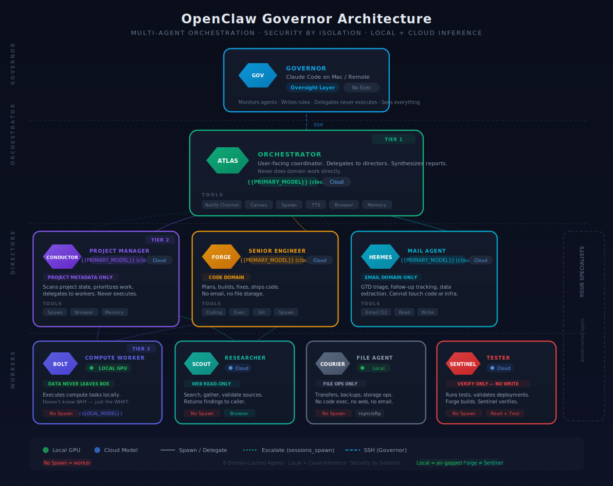

# OpenClaw Governor

You describe what you want. The Governor builds it, deploys it, fixes it, and learns from every failure.

---

## The Problem

Getting one OpenClaw agent running is easy. Getting a reliable fleet? That's where everyone gets stuck. You configure agents, hit a wall, lose track of what you did and why, start over, and repeat. One model trying to plan, research, code, debug, and communicate isn't an agent — it's a burnout simulator with a token bill.

Three things fix it:

1. **Spec-first development** — every change starts with a written spec, not "just build it"
2. **Multi-agent hierarchy** — give your agent agents. An executive that thinks, specialists that own domains, workers that grind
3. **Separation** — the Governor sits outside your OpenClaw runtime. It manages the fleet without being part of it

This template gives you all three out of the box.

---

## Setup

```bash
# Install OpenClaw if you haven't
curl -fsSL https://www.openclaw.ai/install.sh | bash

# Clone this template
git clone https://github.com/snowriderau/OpenClawGovernor.git
cd OpenClawGovernor

# Run the setup wizard — it asks you questions, configures everything
bash scripts/init.sh

# Open your Governor (Claude Code, Codex, Antigravity — whatever you use)
claude
```

The Governor reads its instructions on startup. It reads `INSTALL.md` to bootstrap your fleet. You don't configure anything manually.

---

## What You Actually Do

You talk to the Governor using commands. That's it. The commands trigger spec-driven workflows — the Governor writes specs, you approve them, it builds and deploys.

```
You: "I need my agents to handle email"

  /new-feature email-handling
    → Governor writes a spec
    → You review and approve (or ask for changes)
    → Governor implements — config, workspace files, agent deployment
    → Governor runs /success — commits, updates the feature map, documents what it learned
```

### Core commands

| Command | What you say | What happens |
|---------|-------------|-------------|
| `/new-feature` | "I need X" | Governor writes a spec, you approve, it builds it |
| `/create-task` | "Fix Y" or "Add Z to the email agent" | Governor finds the relevant spec, does the work, updates status |
| `/update-feature` | "Change how X works" | Governor reads the existing spec, plans changes, implements |
| `/agent-improvement` | "Check on the agents" | Governor audits the fleet — logs, tools, permissions, gaps — and fixes what's broken |
| `/success` | (Governor runs this itself) | Commits everything, updates the feature map, syncs OpenClaw, writes lessons |

### Maintenance commands

| Command | What it does |
|---------|-------------|
| `/security_audit` | Reviews permissions, configs, vulnerabilities, recommends fixes |
| `/patch_management` | Checks for updates, assesses risk, applies with rollback plan |
| `/incident_response` | Detects, isolates, preserves evidence, logs everything |
| `/machine_recovery` | Restores from backup, reconfigures, verifies |

### The rule

No code without a spec. No completion without `/success`. If the Governor skips steps — correct it. Every correction becomes a permanent rule in its self-correction table. It won't make the same mistake twice.

---

## How It Works

The Governor sits on your dev machine (or wherever you run Claude Code / Codex / Antigravity). It SSHs into your OpenClaw machine to manage everything.

**Your OpenClaw fleet runs in three tiers:**

| Tier | Job | They can | They can't |
|------|-----|----------|------------|
| **Orchestrator** | Coordinates everything, talks to you | See all agents, delegate work | Execute anything directly |
| **Directors** | Own a domain (code, email, projects) | Dispatch workers, make decisions | See other directors' domains |
| **Workers** | Execute tasks on local GPU / tools | Run fast, handle data | Know why they're doing it |

No single agent has the full picture AND the full toolkit. The orchestrator sees everything but can't execute. Workers execute but don't see the bigger picture. That's the security model — it's architecture, not permissions.

The Governor sits above all of this. It writes the config, deploys the agents, reviews what's working, and fixes what isn't.

<p align="center">
  
</p>

---

## What If the Governor Seems Lost?

Give it a specific command. Instead of "set up my system," say:

```
/new-feature openclaw-setup
/agent-improvement
/create-task "fix the watchdog timer"
```

The commands activate structured workflows. The Governor follows them step-by-step. If it goes off-script, correct it — the correction becomes a permanent rule.

If you're starting fresh after `init.sh`, the Governor will read `INSTALL.md` automatically and bootstrap your fleet. You just approve what it proposes.

---

## What's In This Repo

This is the Governor's workspace — not application code. Your apps and agent workspaces live on the target machine.

```
CLAUDE.md              # Governor's brain — instructions + self-correction table
INSTALL.md             # Bootstrap sequence the Governor executes after init.sh
feature_map.md         # Every feature and its status
specs/                 # Written specs for every feature
.agent/memory/         # Governor's working memory (tasks, backlog, failures)
.claude/commands/      # The slash commands (/new-feature, /agent-improvement, etc.)
.claude/skills/        # OpenClaw and NemoClaw config reference
docs/                  # FAQ, best practices, agent and project examples
scripts/               # Setup wizard
```

| Resource | Location |
|----------|----------|
| FAQ | [docs/faq.md](docs/faq.md) |
| Best practices & operational knowledge | [docs/best-practices.md](docs/best-practices.md) |
| Agent workspace examples | [docs/workspace-examples/](docs/workspace-examples/) |
| Spec-first project template | [docs/project-examples/spec-first-starter/](docs/project-examples/) |
| Agent registry | [specs/AGENT_REGISTRY.md](specs/AGENT_REGISTRY.md) |

---

## The Point

The agents aren't impressive because they're AI. They're impressive because they're organised.

This template captures everything — the architecture, the workflows, the failures, the rules — so you skip the trial and error and start with a system that works.

You focus on what you want your agents to do. The Governor handles how.

## License

MIT
